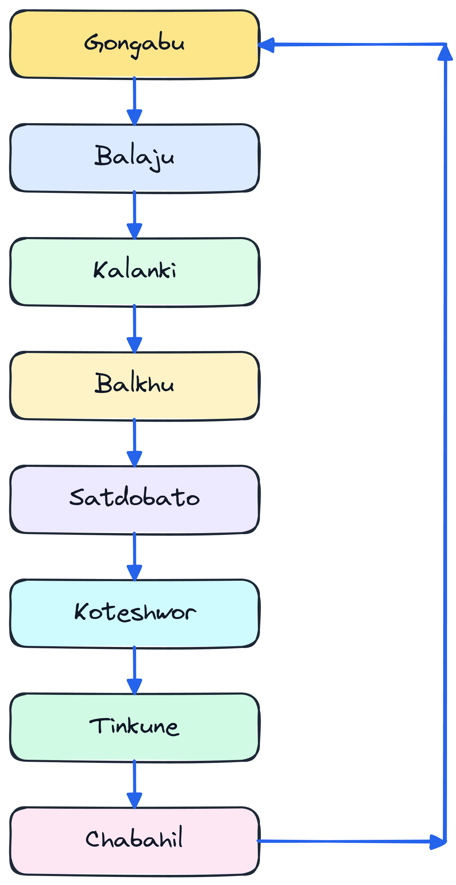
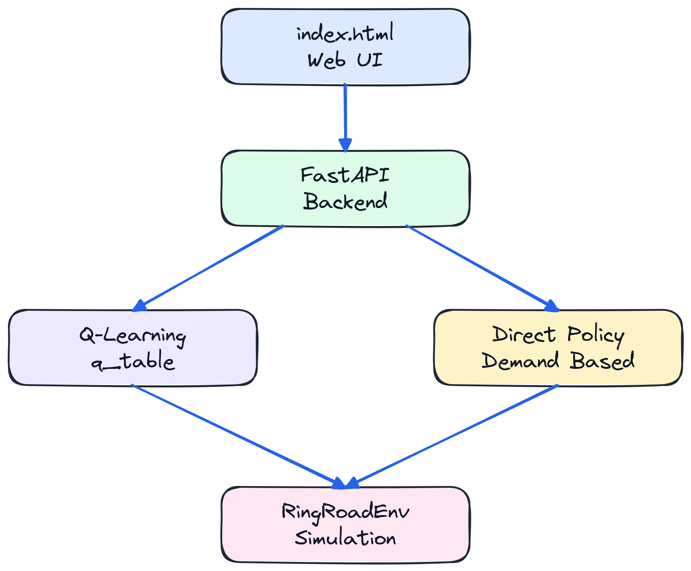
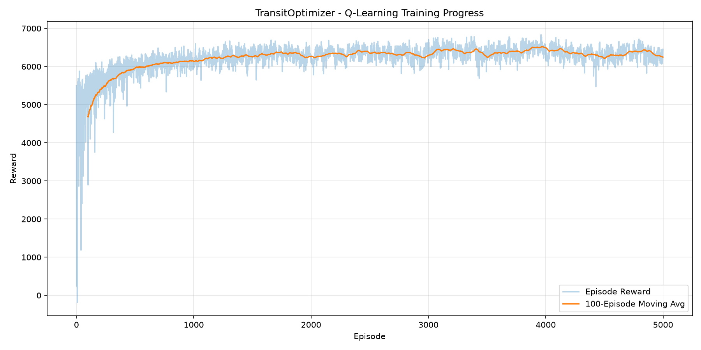
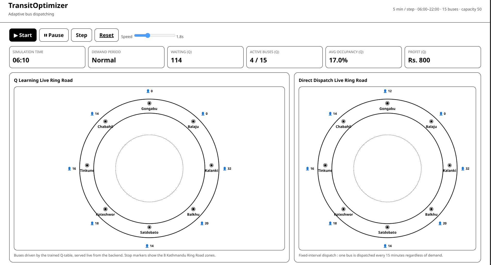

# TransitOptimizer

TransitOptimizer is a **reinforcement learning based public bus dispatching simulation system** designed around the Sample Bus Stop around Kathmandu Ring Road.

The system simulates passenger demand, bus movement, passenger waiting, bus occupancy, revenue, operating costs, and dispatch decisions. A **Q Learning agent** learns how many buses should be dispatched at different traffic-demand conditions.

The project also provides a **FastAPI backend** that loads the trained Q-table and allows a web based UI to simulate and compare:

* **Q-Learning policy**
* **Direct demand based policy**

Both policies can be evaluated under the same demand conditions to make the comparison fair.

---

## 🎯 Project Objectives

The main objectives of TransitOptimizer are:

1. Minimize passenger waiting time.
2. Maintain reasonable bus occupancy.
3. Maximize operational profit.
4. Adapt bus dispatching according to passenger demand.
5. Compare an RL based dispatching strategy with a conventional direct strategy.

---

# 🗺️ Simulated Ring Road

The simulation contains eight bus stops/zones:


<p align="center">
  
</p>

The road is treated as a **ring**, meaning that after Chabahil, the bus returns to Gongabu.

---

# 🧠 Reinforcement Learning

TransitOptimizer uses **Q Learning**, which is a **value based reinforcement learning algorithm**.The agent learns a **Q value function**:

```text
Q(State, Action)
```

The Q value represents how useful an action is when the system is in a particular state.

The agent eventually chooses:

```text
Action = argmax Q(State, Action)
```

Therefore, the trained `q_table.npy` is used to determine the best bus-dispatch action for a given state.

---

# 🚌 Available Actions

The environment defines:

```python
spaces.Discrete(4)
```

There are four possible actions:

| Action | Meaning          |
| -----: | ---------------- |
|    `0` | Dispatch 0 buses |
|    `1` | Dispatch 1 bus   |
|    `2` | Dispatch 2 buses |
|    `3` | Dispatch 3 buses |

The Q Learning agent chooses one of these actions at every simulation step.

---

# ⏰ Time Based Passenger Demand

Passenger demand changes according to the time of day.

The simulation starts at:

```text
06:00
```

and each simulation step represents:

```text
5 minutes
```

There are:

```text
192 steps
```

which represents:

```text
16 hours
```

from approximately:

```text
06:00 → 22:00
```

## Demand Multipliers

| Time        | Demand Level | Multiplier |
| ----------- | ------------ | ---------: |
| 06:00–07:00 | Normal       |      `1.0` |
| 07:00–09:00 | Morning Peak |      `1.8` |
| 09:00–10:00 | Normal       |      `1.0` |
| 10:00–15:00 | Midday Low   |      `0.8` |
| 15:00–16:00 | Normal       |      `1.0` |
| 16:00–19:00 | Evening Peak |      `1.8` |
| 19:00–22:00 | Normal       |      `1.0` |

The demand is generated using a Poisson distribution:

```python
expected_demand = base_demand * multiplier

arrivals = self.np_random.poisson(
    expected_demand
)
```

This means passenger arrivals are stochastic rather than fixed.

---

# 👥 Base Passenger Demand

Each zone has a different base demand.

| Zone      | Base Demand |
| --------- | ----------: |
| Gongabu   |          10 |
| Balaju    |           7 |
| Kalanki   |          12 |
| Balkhu    |           8 |
| Satdobato |           9 |
| Koteshwor |          14 |
| Tinkune   |           8 |
| Chabahil  |          10 |

During peak periods, these values are multiplied by `1.8`.

For example, Koteshwor has:

```text
Base demand = 14
```

During a peak:

```text
14 × 1.8 = 25.2 passengers/step
```

The actual number of arriving passengers is sampled from the Poisson distribution.

---

# 🚌 Bus Configuration

The environment contains:

```text
Total fleet = 15 buses
Bus capacity = 50 passengers
```

Every dispatched bus starts from:

```text
Gongabu
```

A bus moves one zone every simulation step.

Since:

```text
1 step = 5 minutes
```

a bus takes approximately:

```text
5 minutes
```

to travel between consecutive simulated zones.

After completing the full ring, the bus is removed from the active fleet and becomes available for future dispatch.

---

# 👨‍👩‍👧 Passenger Processing

When a bus reaches a zone:

1. Some existing passengers leave the bus.
2. Remaining capacity is calculated.
3. Waiting passengers board the bus.
4. Waiting passengers are removed from the zone.
5. Revenue is generated from boarded passengers.

Passenger departure is randomly generated between:

```text
10% – 30%
```

of the passengers currently on the bus.

The maximum bus capacity is:

```text
50 passengers
```

Therefore:

```python
boarded = min(
    waiting,
    available_capacity
)
```

---

# 💰 Revenue and Cost

The fare is:

```text
Rs. 30 per passenger
```

The operating cost is:

```text
Rs. 40 per active bus per simulation step
```

Therefore:

```text
Revenue = passengers served × Rs.30
```

and:

```text
Operating Cost =
active buses × Rs.40
```

The environment calculates:

```text
Profit = Total Revenue − Total Cost
```

---

# 🎁 Reward Function

The Q-Learning agent does not directly optimize the profit value.

Instead, it receives a reward calculated using:

```text
Reward =
Service Reward
− Bus Cost Penalty
− Waiting Penalty
− Overcrowding Penalty
```

### Service Reward

```python
service_reward = boarded * 0.5
```

More passengers served produce a higher reward.

### Active Bus Penalty

```python
cost_penalty = len(self.buses) * 1.0
```

Running more buses creates a penalty.

### Waiting Passenger Penalty

```python
waiting_penalty = waiting.sum() * 0.1
```

More waiting passengers produce a larger penalty.

### Overcrowding Penalty

If average occupancy exceeds 80%:

```python
overcrowd_penalty =
    (occupancy - 0.80) * 20
```

This encourages the agent to avoid excessive overcrowding.

---

# 👀 Environment Observation

The environment produces an observation containing information about all eight zones.

For every zone:

```text
[waiting,
 future demand,
 bus ETA,
 unmet demand]
```

Therefore:

```text
8 zones × 4 features = 32 values
```

Four global values are also included:

```text
available buses
active buses
average occupancy
current hour
```

So the total observation size is:

```text
32 + 4 = 36
```

> **Important:** With the `RingRoadEnv` code shown here, the observation contains **36 values**, not 35.

---

# 🔢 State Discretization

Q Learning uses a Q table, which requires a **finite/discrete state representation**.

However, the environment produces continuous values such as:

```text
waiting passengers = 87
occupancy = 0.63
hour = 14.25
```

Therefore, the observation is converted into discrete levels.

The discretization uses:

| Feature            | Levels |
| ------------------ | -----: |
| Time of day        |      3 |
| Waiting passengers |      6 |
| Occupancy          |      4 |
| Demand             |      4 |
| Active buses       |      4 |
| Available buses    |      3 |

The total number of possible states is:

```text
3 × 6 × 4 × 4 × 4 × 3
= 3456 states
```

With four actions:

```text
3456 × 4
= 13,824 Q-values
```

Therefore the Q-table has approximately:

```text
3456 × 4
```

entries.

---

# 🧮 Q-Table

The Q-table is initialized using:

```python
self.q_table = np.zeros(
    (state_size, action_size)
)
```

Its structure is:

```text
                Actions
          0      1      2      3
       ┌──────┬──────┬──────┬──────┐
State 0│ Q00  │ Q01  │ Q02  │ Q03  │
       ├──────┼──────┼──────┼──────┤
State 1│ Q10  │ Q11  │ Q12  │ Q13  │
       ├──────┼──────┼──────┼──────┤
State 2│ Q20  │ Q21  │ Q22  │ Q23  │
       ├──────┼──────┼──────┼──────┤
  ...  │ ...  │ ...  │ ...  │ ...  │
       └──────┴──────┴──────┴──────┘
```

For example:

```text
Q[1250, 0] = 10.5
Q[1250, 1] = 18.2
Q[1250, 2] = 25.7
Q[1250, 3] = 14.3
```

The agent chooses:

```text
Action 2
```

because it has the highest Q-value.

---

# 🔄 Q-Learning Update

The agent updates the Q-table using the standard Q-Learning equation:

```text
Q(s,a) ← Q(s,a)
       + α [r + γ max Q(s',a') − Q(s,a)]
```

where:

* `s` = current state
* `a` = selected action
* `r` = reward
* `s'` = next state
* `α` = learning rate
* `γ` = discount factor

The implementation uses:

```python
learning_rate = 0.1
discount_factor = 0.95
```

---

# 🎲 Exploration vs Exploitation

During training, the agent uses an **epsilon-greedy strategy**.

With probability `epsilon`:

```text
Explore
→ choose a random action
```

Otherwise:

```text
Exploit
→ choose the action with highest Q-value
```

Initially:

```text
epsilon = 1.0
```

so the agent explores heavily.

During training:

```python
epsilon =
    max(
        epsilon_min,
        epsilon * epsilon_decay
    )
```

The training configuration uses:

```text
epsilon_decay = 0.998
epsilon_min = 0.02
```

Eventually, the agent mostly exploits its learned Q-values.

---

# 🏋️ Training

The Q-Learning agent is trained for:

```text
5000 episodes
```

Each episode represents one simulated operating day.

The basic training process is:

```text
Start Environment
       ↓
Reset Environment
       ↓
Observe State
       ↓
Discretize State
       ↓
Choose Action
       ↓
Dispatch Buses
       ↓
Generate Passenger Demand
       ↓
Process Passengers
       ↓
Calculate Reward
       ↓
Move Buses
       ↓
Observe Next State
       ↓
Update Q-table
       ↓
Repeat
       ↓
End Episode
       ↓
Decay Epsilon
```

---

# 💾 Saving the Trained Model

After training, the Q-table is saved as:

```text
q_table.npy
```

using:

```python
np.save(
    "q_table.npy",
    agent.q_table
)
```

This file represents the learned knowledge of the Q-Learning agent.

---

# ⚡ FastAPI Backend

The project provides a FastAPI backend that connects the trained Q-Learning model with the web UI.

The backend:

1. Loads `q_table.npy`.
2. Creates the environment.
3. Runs the simulation.
4. Converts observations into states.
5. Uses the Q-table to select actions.
6. Collects simulation statistics.
7. Compares Q-Learning with the direct policy.
8. Returns results to the frontend as JSON.

The architecture is:

<p align="center">
  
</p>

---


# 📈 Simulation Training Metrics


<p align="center">
  
</p>

# 🖥️ Web UI

The frontend provides a visual representation of the simulation.

The UI can display as below:


<p align="center">
  
</p>
---

# 📁 Project Structure


### `environment.py`

Contains the Gymnasium environment:

```text
RingRoadEnv
```

It handles:

* Passenger demand
* Time
* Bus movement
* Passenger boarding
* Waiting time
* Revenue
* Cost
* Profit
* Reward
* Observation

### `train.py`

Contains:

```text
QLearningAgent
```

and handles:

* State discretization
* Q-table creation
* Q-learning training
* Epsilon decay
* Q-table saving
* Training graph

### `backend.py`

Contains the FastAPI server.

It handles:

* Loading the Q-table
* Running simulations
* Q-Learning inference
* Direct-policy simulation
* Comparing results
* Serving the frontend

### `index.html`

Provides the visual simulation interface.

### `q_table.npy`

Contains the trained Q-values.

### `training_progress.png`

Contains the training reward graph.

---

# 🚀 Installation
Clone the repository

```bash
https://github.com/roshan-acharya/TransitOptimizer.git
cd TransitOptimizer
```


Install the required packages:

```bash
pip install -r requirements.txt
```

---

# 🏋️ Train the Agent

Run:

```bash
cd agent
python train.py
```

After training, the project should generate:

```text
q_table.npy
training_progress.png
```

---

# 🌐 Start the Backend

Run:

```bash
uvicorn backend:app --reload
```

Run index.html
---


# ⚠️ Current Environment Details

The simulation currently uses:

```text
Fleet:                  15 buses
Capacity:               50 passengers/bus
Fare:                   Rs. 30/passenger
Operating cost:         Rs. 40/bus/step
Simulation step:        5 minutes
Simulation duration:    16 hours
Number of zones:        8
Actions:                4
Training episodes:      5000
```

---


# 🔑 Key Technologies

* **Python**
* **Gymnasium**
* **NumPy**
* **Q-Learning**
* **FastAPI**
* **Uvicorn**
* **HTML/CSS/JavaScript**
* **Matplotlib**


